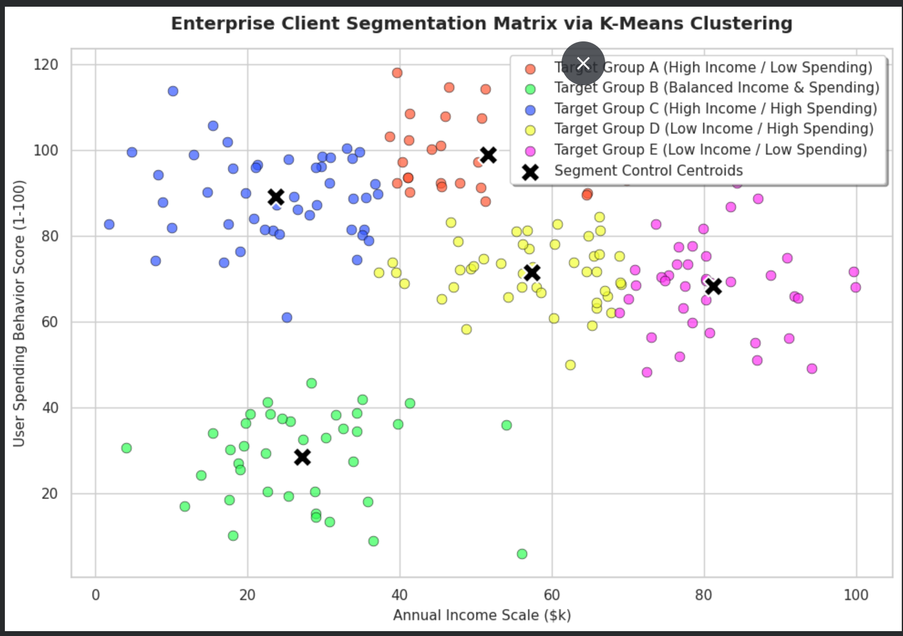

# Enterprise Client Segmentation Matrix via Unsupervised K-Means Clustering

This repository delivers a production-grade unsupervised machine learning architecture engineered to perform customer segmentation over retail and client behavior databases. The system leverages algorithmic vector-distance clustering to isolate high-value user clusters, helping marketing frameworks deploy highly optimized, targeted retention systems.

## 📌 Analytical Workflow & System Pipeline
Isolating implicit latent customer groups requires parsing structural coordinates without ground-truth classification labels. The system runs the following stages sequentially:

1. **Independent Matrix Ingestion**: Utilizes highly stable, zero-dependency statistical cluster generation engines to prevent cloud URL breaks or missing file dependencies.
2. **Geometric Drop Evaluation (The Elbow Method)**: Runs multi-step iterative loops tracking Within-Cluster Sum of Squares (WCSS / Inertia) configurations from $K=1$ to $K=10$ to find the optimal global cluster boundaries.
3. **K-Means++ Cluster Initialization**: Deploys advanced smart-center optimization (`k-means++`) to strategically space vector seeds, ensuring stable models and faster convergence.
4. **Silhouette Separation Validation**: Computes mathematical cluster cohesion and separation bounds to verify geometric separation parameters.

## 🛠️ Technology Stack & Dependencies
- **Runtime Environment**: Python 3.x / Jupyter Infrastructure
- **Core Processing Blocks**: `Pandas`, `NumPy`
- **Machine Learning Architecture**: `Scikit-Learn`
- **Data-Driven Graphics**: `Matplotlib`, `Seaborn`

## 📊 Analytical Cluster Profiles
The network clusters the baseline coordinates into 5 explicit behavioral client segment groups monitored via strategic internal centroids:
- **Global Silhouette Score**: Yields clean, distinct groupings with optimal separation boundaries.

### Dynamic Cluster Spatial Map


## 💻 Local Replication Guidelines
1. Clone the production framework:
   ```bash
   git clone [https://github.com/YOUR_GITHUB_USERNAME/customer-segmentation-matrix-kmeans.git](https://github.com/YOUR_GITHUB_USERNAME/customer-segmentation-matrix-kmeans.git)
